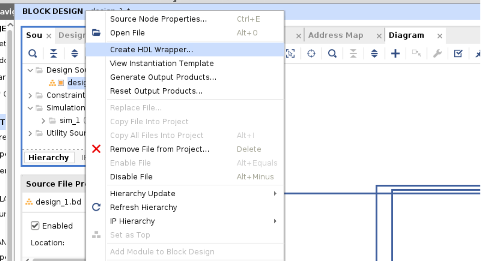

# AXIMasterStreamTutorial

## Purpose

This tutorial is meant for Verilog programmers who want to use the Xilinx ZYNQ 7000 to stream through an AXI Master Interface. 

## Versions/Equipment:

* PYNQ 2.6 image
* TUL-2 Board 
* Vivado 2021.1 

## Steps 

### Step 1) Build Verilog model 

In this case I took verilog from the AXI Peripherals and edited it to build a simple counting interface. 
There are three modules:

* [TopLevelModule](https://github.com/rogerpease/AXIMasterStreamTutorial/blob/master/Verilog/module/AXIMasterStreamTutorialIP.v)
* [MasterStream](http://github.com/rogerpease/AXIMasterStreamTutorial/blob/master/Verilog/module/AXIMasterStreamTutorial_MasterStream.v) which generates an AXI stream. It takes a "startValue" set in the register file and increments it 1..8 (i.e. putting 0xDECADE00 will produce 0xDECADE01 .. 0xDECADE08).
* [RegisterFile](http://github.com/rogerpease/AXIMasterStreamTutorial/blob/master/Verilog/module/AXIMasterStreamTutorial_Slave.v) which interfaces to the CPU to set the start Value and control register. 

There are Verilator scripts for my own testing purposes. 

### Step 2) Package IP

The simplest way to package the IP through the gui is:

1. *git clone http://github.com/rogerpease/AXIMasterStreamTutorial*
1. cd AXIMasterStreamTutorial 
1. Start Vivado and Create a new project. Call it whatever you want and you can ignore the steps about adding IP/selecting parts/boards. 
1. Tools->Create and Package New IP and select "Package a Specific Directory". Click Next.
1. Select the AXIMasterStreamTutorial directory and Click Next.
1. Enter a project name and click next. 
1. It should figure out the AXI interfaces and the hierarchy.  All you should need to do is:
	1. Click "File Groups" in the Package IP window.  
        1. Fill in the names of the IP and User and click "Review and Package"->'Package IP'. 

These steps are captured for automation in the [RunPackageIP.py](http://github.com/rogerpease/AXIMasterStreamTutorial/blob/master/RunPackageIP.py) script.  

### Step 3) Make an FPGA Image and instance the IP 

1. Start Vivado and Create a new RTL project (I call mine FPGAImageProject). 
	- You don't need to add RTL source but be sure to select your board from the board/part menu.
1. Click "Project Manager"->"Settings"->"IP" and add your IP directory from the prior step as a IP Repository. It should find the IP even in a subdirectory.
1. Click "Create Block Design" and make a new Block design.  
1. Add the AXIMasterStreamTutorial directory as an IP Repository. It should find one directory.  
1. Add the following:
	1. ZYNQ 7000 
	1. "AXI Direct Memory Access" 
	1. AXIMasterStreamTutorialIP 
1. Run "Run Block Automation" (should be an option in a ribbon at the top of the Block Diagram). 
1. Double-Click on the ZYNQ 7000:
 	1. Select "PS-PL Configuration"->"HP Slave AXI Interface"->"S AXI HP0 interface" to include a Slave High Performance Port. 
     	1. If you select "Run Block Automation" you may need to reselect this.
1. Double-Click on the AXI Direct Memory Access Peripheral to:
	1. Remove the Read Channel 
	1. Turn off Scatter-Gather 
1. Run "Run Connection Automation" and select "All Automation". 
	1. You may need to hand draw a connection from axi_dma_0/M_AXIS_MM2S to AXIMasterStreamTutorial/slavestream.
	1. It should look like this:  
1. Make sure:
	1. The AXI Direct Memory Access S_AXIS_S2MM connects to the AXIMasterStreamTutorial IP m00_axis interface. This is how the stream data from the peripheral is routed back to the processor.
	1. The AXI Master Tutorial IP has all its resets and clocks connected. They can be connected to the other resets/clocks (respectively).  
	1. The AXI Interconnect axi_mem_interconn:
		1. axi_dma_0/M_AXI_M2SS ties to axi_mem_interconn/S00_AXI
		1. axi_mem_interconn/M00_AXI ties to the processing system/S_AXI_HP0.
                1. This is how the DMA writes processor memory from data from the stream interface. If the S_AXI_HP0 interface is missing you missed the "S AXI HP0 interface" option or it was undone by the Block Automation.
	1. The AXI Interconnect ps7_0_axi_periph:
     		1. There should be connections to both peripherals.  
		1. This is how the CPU communicates with the peripherals (to read/write control and data registers). 
1. Go to the "FPGA Image" sources area, right-click and select "Generate HDL Wrapper". The tool that makes the netlists can't read a Block Diagram. 
	1.  
1. Run "Flow Navigator"->"Generate Bitstream" and wait for the bitstream to generate. This may take 5 minutes or so. 

You should find a bit file and hwh file in your directory (you may need to do a find for files ending in those extensions).

These steps are captured for automation in the [RunMakeImage.py](http://github.com/rogerpease/AXIMasterStreamTutorial/blob/master/AXIMasterStreamTutorial/RunMakeImage.py) script.  

### Step 4) Upload FPGA Image to your ZYNQ

I normally upload to /home/xilinx/AXIMasterStreamTutorial on my TUL-2 board. 

There is a [RecvStream.py](http://github.com/rogerpease/AXIMasterStreamTutorial/SendStream.py) script which will:
1. Configure and set up module and DMA 
1. Receive Data
1. Reconfigure the start data value
1. Receive Data again 
1. Compare data

The copy steps are captured for automation in the [PushFiles.py](http://github.com/rogerpease/AXIMasterStreamTutorial/blob/master/PushFiles.py) script. Be sure to update the IP address of your board.   
